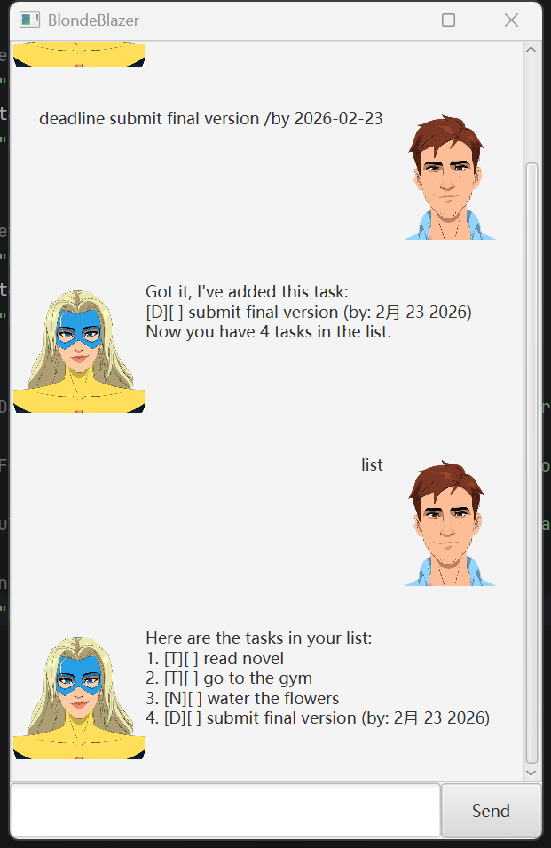

# BlondeBlazer User Guide



BlondeBlazer is a task manager chatbot that helps users keep track of their tasks using simple text commands.

---

## Features

### Add a ToDo

Adds a ToDo task to the list.

**Command:**
todo read a book

**Example:**
```
Got it, l've added this task.
[T][] read a book
Now you have X tasks in the list.
```


### Add a Note

Adds a Note to the list.

**Command:**
note go swimming

**Example:**
```
Got it, l've added this note:
[N][] go swimming
Now you have X tasks in the list.
```


### Add a Deadline

Adds a deadline task with a due date.

**Command:**
deadline read a book /by 2026-02-25

**Example:**
```
Got it, l've added this task:
[D][] read a book (by: 2月 25 2026)
Now you have X tasks in the list.
```


### Add a Event

Adds a event task with a start and end time.

**Command:**
event read a book /from 2pm /to 3pm

**Example:**
```
Got it, l've added this task:
[E][] read a book (from: 2pm to: 3pm)
Now you have X tasks in the list
```


### Get the task list
 
Displays all tasks in the list.

**Command:**
list

**Example:**
```
Here are the tasks in your list:
1. [T][] read novel
2. [T][] go to the gym
3. [N][] water the flowers
4. [D][] submit final version (by: 2月 23 2026)
5. [E][] read a book (from: 2pm to: 3pm)
```


### Mark task

Marks a task as done.

**Command:**
mark 2

**Example:**
```
Nice, l've marked this task as done!
2. [T][X] go to the gym
```


### Unmark task

Unmarks a task as not done.

**Command:**
unmark 2

**Example:**
```
OK, l've marked this task as not done.
2. [T][] go to the gym
```


### Delete a task

Removes a task from the list.

**Command:**
delete 2

**Example:**
```
Noted.l've removed this task:
[T][] go to the gym
Now you have X tasks in the list.
```


### Find tasks

Search for all tasks that contain a certain string.

**Command:**
find book

**Example:**
```
Here are the matching tasks in your list:
4. [T][X] read a book
7. [E][] read a book (from: 2pm to: 3pm)
```


### Search for a deadline task

Searches for a task that due on a certain date.

**Command:**
on 2025-02-25

**Example:**
```
Here are the tasks on 2026-02-25:
5.[D][] read a book (by: 2月 25 2026)
```


### Bye

Closes the application

**Command:**
bye

